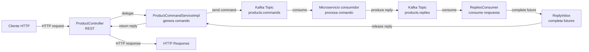

# Products API Microservicio (ORIGEN)

## Resumen

Este microservicio expone una API REST para operaciones CRUD sobre productos, pero no guarda los datos localmente. En lugar de ello, funciona como un gateway de comandos hacia Kafka usando Spring Cloud Stream. Las solicitudes REST se convierten en comandos Kafka y el servicio espera una respuesta correlacionada para devolver el resultado al cliente.

Para visitar el microservicio de destino donde  recibe los mensajes KAFKA que le enviamos desde el origen visita el micro [products-command](https://github.com/Mr-Machine98/products-command)

## Arquitectura general

- `ProductController` expone los endpoints REST.
- `ProductCommandServiceImpl` construye comandos y los envía al topic Kafka `products.commands`.
- `ReplyInbox` actúa como un buzón en memoria para esperar la respuesta de Kafka.
- `RepliesConsumer` consume mensajes del topic `products.replies` y completa la solicitud esperada usando `correlationId`.
- La configuración en `application.properties` define los bindings de salida e ingreso de Spring Cloud Stream.

## Flujo de solicitud-respuesta

1. El cliente llama a uno de los endpoints REST del controlador.
2. `ProductController` delega la operación a `IProductCommandService`.
3. `ProductCommandServiceImpl` crea un objeto `Command<T>` con:
   - `type` (operación): `CREATE`, `READ`, `READ_ALL`, `UPDATE`, `DELETE`
   - `id` cuando aplica
   - `body` con el `ProductDto` cuando aplica
4. Se genera un `correlationId` único y se registra un `CompletableFuture` en `ReplyInbox`.
5. El comando se envía a Kafka usando `StreamBridge` al binding `commands-out-0`.
6. La aplicación espera hasta 5 segundos por la respuesta correlacionada.
7. Cuando llega un mensaje al topic `products.replies`, `RepliesConsumer` extrae el header `correlationId` y completa el futuro.
8. El controlador transforma el `Reply<?>` en una respuesta HTTP:
   - `200 OK` si `reply.status() == SUCCESS`
   - `400 Bad Request` con un cuerpo de error si `reply.status() == ERROR`

## Diagrama de flujo



## Endpoints REST

- `POST /products`
  - Crea un producto.
  - Body: `ProductDto`
- `GET /products/{id}`
  - Obtiene un producto por ID.
- `GET /products`
  - Obtiene todos los productos.
- `PUT /products/{id}`
  - Actualiza un producto.
  - Body: `ProductDto`
- `DELETE /products/{id}`
  - Elimina un producto por ID.

## Payloads y modelos

### ProductDto

- `name`: `String`, no puede estar vacío.
- `price`: `Double`, valor mínimo 10.

### Command<T>

Registro de comando enviado a Kafka:
- `type`: `CommandType`
- `id`: `Long`
- `body`: payload genérico, típicamente `ProductDto`

### Reply<T>

Respuesta esperada de Kafka:
- `status`: `ReplyStatus` (`SUCCESS` o `ERROR`)
- `message`: descripción del resultado o error
- `body`: datos devueltos (producto, lista de productos, etc.)

## Mecanismo de correlación

- Cada comando se envía con un header `correlationId` generado con `UUID.randomUUID().toString()`.
- `ReplyInbox` guarda un futuro asociado a ese `correlationId`.
- Cuando llega la respuesta, `RepliesConsumer` lee el header y completa el futuro correcto.
- Esto implementa un patrón de request-response sobre Kafka.

## Configuración de Kafka

En `src/main/resources/application.properties` se define:

- `spring.application.name=products-api`
- `server.port=8080`
- `spring.cloud.stream.bindings.commands-out-0.destination=products.commands`
- `spring.cloud.stream.bindings.commands-out-0.content-type=application/json`
- `spring.cloud.stream.kafka.binder.brokers=kafka:19092`
- `spring.cloud.function.definition=handleReplies`
- `spring.cloud.stream.bindings.handleReplies-in-0.destination=products.replies`
- `spring.cloud.stream.bindings.handleReplies-in-0.content-type=application/json`
- `spring.cloud.stream.bindings.handleReplies-in-0.group=products-api`
- `spring.cloud.stream.kafka.bindings.handleReplies-in-0.consumer.startOffset=latest`

## Topics Kafka requeridos

- `products.commands` — recibe comandos enviados por este microservicio.
- `products.replies` — envía respuestas de vuelta al microservicio.

## Consideraciones

- El servicio es síncrono desde el punto de vista REST, pero usa Kafka como transporte asíncrono.
- Si no llega respuesta dentro del timeout configurado (5 segundos), se lanza una excepción y la llamada falla.
- `ReplyInbox` usa un `ConcurrentHashMap`, por lo que es seguro para concurrencia dentro del mismo nodo.
- No hay persistencia local de productos; la lógica de negocio y almacenamiento deben estar en otro microservicio consumidor de `products.commands`.

## Ejemplo de uso

### Crear producto

POST `/products`

Body:
```json
{
  "name": "Mouse inalámbrico",
  "price": 25.0
}
```

### Respuesta esperada

```json
{
  "id": 123,
  "name": "Mouse inalámbrico",
  "price": 25.0
}
```

## Notas para desarrolladores

- `ProductsApiApplication` inicia la aplicación Spring Boot.
- `ProductController` no contiene lógica de negocio, solo traduce HTTP a comandos.
- `ProductCommandServiceImpl` es el núcleo del envío de comandos y espera de respuestas.
- Modificar el timeout o la lógica de manejo de errores requiere cambios en `sendAndAwait` y posiblemente en la forma en que se completa `ReplyInbox`.
- Si se necesita expandir a más operaciones, agregar nuevos valores en `CommandType` y soporte correspondiente en el consumidor de comandos.
